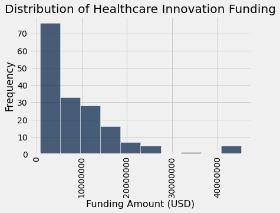
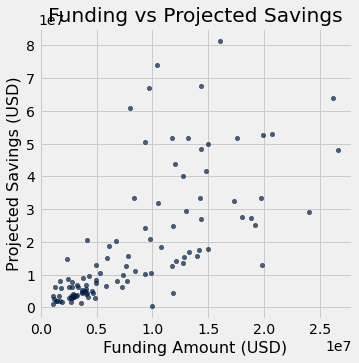

# Healthcare-Innovation-Funding-Analysis

# Evaluating Healthcare Innovation Investments and Their Expected Impact

A data analysis project examining whether higher healthcare innovation funding is associated with greater projected savings, using a public CMS dataset.

## Question

Does more funding for healthcare innovation initiatives actually translate into greater expected financial impact — or are other factors driving outcomes?

## Data

- **Source:** Innovation Center Model Awardees dataset, published by the Centers for Medicare & Medicaid Services (CMS), accessed via Data.gov
- **Fields used:** funding amount and 3-year projected savings per healthcare innovation initiative

## Approach

1. **Cleaning:** Converted funding and savings fields from currency-formatted strings (e.g. "$1,200,000") to numeric values, and removed rows with missing data
2. **Distribution analysis:** Built a histogram of funding amounts across projects to understand how funding is distributed
3. **Relationship analysis:** Built a scatter plot of funding vs. projected savings to examine correlation and variability
4. **Stakeholder interpretation:** Considered findings from the perspective of policymakers (CMS) and healthcare/biopharmaceutical companies

## Key findings

**Funding is heavily right-skewed.** Most projects receive relatively modest funding, while a small number of initiatives receive disproportionately large investments.

**Higher funding doesn't reliably predict higher projected savings.** There is a general positive relationship, but it's inconsistent — some low-funded projects show high projected savings, while some high-funded projects show comparatively low returns.

## So what?

Funding *size* alone isn't a reliable indicator of expected impact. This suggests that how funding is allocated and managed — not just how much is allocated — deserves more attention from policymakers evaluating healthcare innovation investment strategy.

## Tools

Python, datascience Table library, matplotlib, Jupyter Notebook

## Files

- `healthcare_innovation_funding_analysis.ipynb` — full analysis notebook
- `histogram_funding_distribution.png`, `scatter_funding_vs_savings.png` — key visualizations

---
*Academic project, Spring 2026.*
